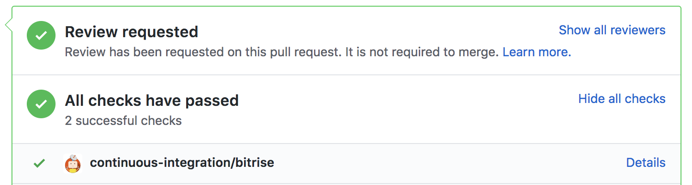
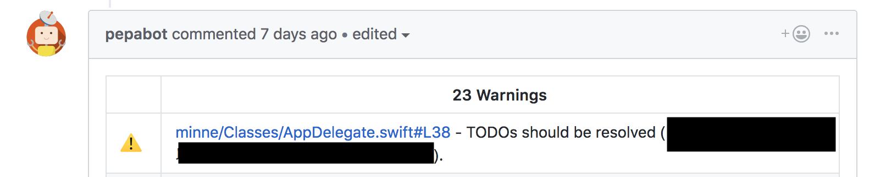
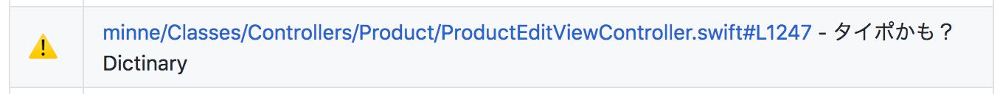
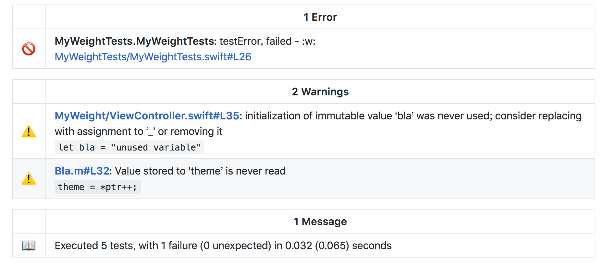
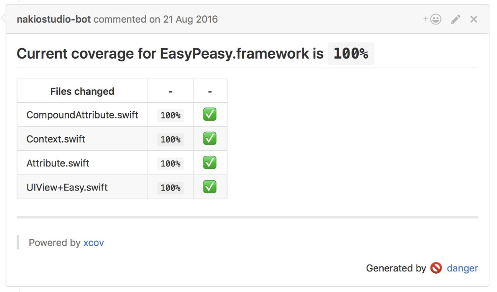
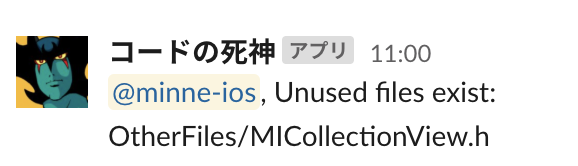
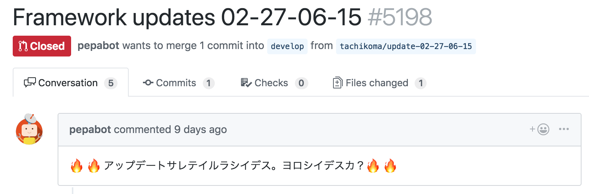
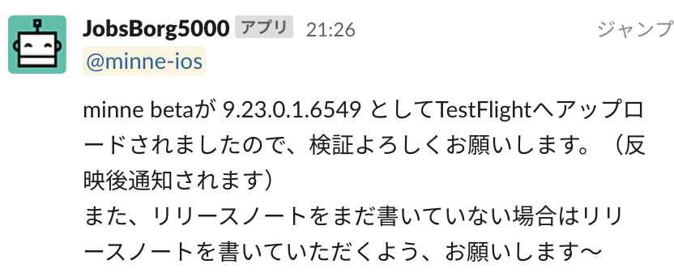
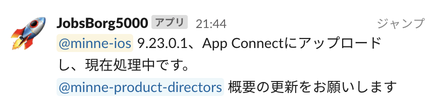

slidenumbers: true
slide-transition: true

# [fit] Automate all the things

---

# Self Intro

- Joshua Kaplan
- minne @ GMO Pepabo
- Danger-Swift contributer
- Likes 🤖

^ 日本最大のハンドメイドマーケットプレイスである minne の iOS エンジニア
本日発表する Danger の contributer
機械に仕事をしてもらうのが好き

---

# [fit] Why automate?

---

- Fewer mistakes
- Increase development speed
- More efficient
- More exciting

^ “Emotion” and coaching can only get you so far. Improve stability and reliability

---

# [fit] What areas to automate?

---

- Take much time
- Take time for _multiple people_
- High risk
- Prone to being forgotten

^(it’s not just yourself doing that task 15 minutes a month
^(eg: major bugs w/ calendar or answering a question wrong w/ App Submission)
^ (closing the milestone and making release notes)

---

# [fit] Tools of the trade

---

# [fit] Fastlane

^ The classic set of tools that almost every team of two or more developers use
^ More built in features for delivering, testing, taking screenshots, and more
^ Many tools are wrappers for xcodebuild and Apple utilities
^ Uses headless browser due to lack of APIs, so sometimes breaks

---

# [fit] Danger

^ Programmable set of rules that are applied to PRs

---

# [fit] SwiftLint

---

# [fit] Scripting languages

^ Swift, shell, ruby, python

---

# [fit] Bots and Github apps

---

* [Probot](https://probot.github.io/docs/development/)
* Automatically marking old branches as stale
* Reminders
* Delete merged branch
* Marking issues to be closed when PR is merged
* Updating dependencies automatically

---

# [fit] CI is the ultimate automation tool

^ Combining the tools above w/ CI

---

# [fit] Normal CI flow (level 1)

---

# Run tests for each PR

^ Github につなげて、単体テストをすべての PR に対して実行する
これを code review と組み合わせて、品質を担保する

---



---

# [fit] Intermediate CI flow (level 2)

^ それだけではない

---

# [fit] Linters and other static analysis

^ linter などの静的解析ツールにより、さらなる品質とレビューの自動化を実現できる

---

# SwiftLint + Danger

^ これだいたい知られているやつ

```rb
swiftlint.lint_files inline_mode: true
```

---



---

# Original static analysis

---

# Spell checking

^ 私が職場で唯一の英語ネーティブなので、スペルに厳しいやつとして見られた
スペルの間違いは私がいつも気づくからだ
エンジニアは機械に怒られることにとっても慣れているので、ボットにやらせることで、自分の厳しい印象を払拭して、自分の仕事を楽にした
cspell という JS のツールを使っている. Xcode には spell check のメニュー項目はあるが、機能しない

---



---

```rb
# タイポを検知する
added_and_modified_files = git.added_files + git.modified_files
added_and_modified_files.each do |file_path|
  next unless file_path =~ /\.swift$/
  stdout, status = Open3.capture2("npx", "cspell", file_path)

  next if status.success?
  stdout.split("\n").each do |line|
    next unless matches = /\w+\.swift:(\d+).*-\sUnknown\sword\s\((\w+)\)/.match(line)
    line_number = matches[1].to_i
    word = matches[2]

    warning = "タイポかも？ #{word}"
    warn(warning, file: file_path, line: line_number)
  end
end
```

---

# [fit] Automate PR tasks

---

# Assign reviewers

---

```rb
# レビュワー指定（コメント指定のためにこれを一番上に書く必要あり）
reviewers = ["user1", "user2", "user3"].reject { |reviewer| reviewer == github.pr_author }
repo_name = github.pr_json["head"]["repo"]["full_name"]
pr_number = github.pr_json["number"]

number_of_comments = github.api.issue_comments(repo_name, pr_number).size
if number_of_comments.zero?

  reviewers = reviewers.sample(2)

  github.api.request_pull_request_review(
    repo_name,
    pr_number,
    {},
    "reviewers": reviewers
  )
end
```

---

# Post CI results

^ CI のログを見に行く時間を減らすと楽
また、某 B 社のちょっと遅いログのロード時間を省ける

---



---

```rb
# Xcode Summary
build_report_file = 'build_results.json'
xcode_summary.ignored_files = 'Pods/**'
xcode_summary.ignores_warnings = true
xcode_summary.inline_mode = true
xcode_summary.report build_report_file
```

---

# Post code coverage

^ 絵文字でテストを書くモチベーションをあげる
また、最低のカバレッジを設定できるので、品質管理の面でも効果的

---



---

```rb
xcov.report(
  scheme: 'minne',
  workspace: 'minne.xcworkspace',
  exclude_targets: 'TodayExtension.appex, NotificationServiceExtension.appex, MinneKit.framework',
)
```

---

# Check for dead code

^ minne では Swift 化を積極的に行なっているので、使われていないコードに時間をかけて、Swift 化したら、もったいない
本当は Go の linter みたいに PR で確認したいけど、Periphery はビルドが必要なので、定期実行にしている

---

## 

---

```rb
def get_dead_objc_code
  std_out, status = Open3.capture2("bundle", "exec", "fui", "--ignorexib", "--path", "minne/Classes")
  # fuiのexitstatusは、使われていないクラスの数で、
  # Bridging-Headerが必ず当たってしまうので、
  # 2つ以上の結果がある場合通知している。
  return status.exitstatus >= 2 ? std_out : ""
end

def get_dead_swift_code
  std_out, _ = Open3.capture2("periphery", "scan")
  r = /minne.*(Struct|Class) .*is unused$/
  filtered_results_array = std_out.to_enum(:scan,r).map {$&}.flatten
  return filtered_results_array.join("\n")
end

# Main
dead_objc_result = get_dead_objc_code
dead_swift_result = get_dead_swift_code
mention = "<!subteam^S1DDSFQSF|minne-ios>"
message = "#{mention}, Unused files exist:\n"

notify_slack(message + dead_objc_result) unless dead_objc_result == ""
notify_slack(message + dead_swift_result) unless dead_swift_result == ""
```

---

# Custom linter rules

```yml
prefer_gregorian_calendar:
  name: "Gregorian Calendar"
  regex: "Calendar\\.current"
  message: "Please use `Calendar(identifier: .gregorian)` to avoid Japanese calendar-related bugs"
  severity: error
https_only:
  name: "HTTPS Only"
  match_kinds:
    - string # コメントなどを無視して、文字列のみをみる
  regex: "http:"
  message: "Please use HTTPS due to security policy"
  severity: error
```

^ すべての会社には、特定のルールやベストプラクティスがあるので、custom ルールでそのルールの遵守を担保できる

---

# [fit] Advanced CI flow (level 3)

---

# [fit] Runtime analysis and integration tests

---

* Checking for thread issues (thread sanitizer)
* Checking for memory leaks
* Performance tests

---

# [fit] Automatic dependency updates

---



---

# [fit] Deployment

---


---



---



---

```rb
lane :release do
  capture_screenshots                  # generate new screenshots for the App Store
  sync_code_signing(type: "appstore")  # see code signing guide for more information
  build_app(scheme: "MyApp")
  upload_to_app_store                  # upload your app to App Store Connect
  slack(message: "Successfully uploaded a new App Store build")
end
```

---

# [fit] Speed optimization

---

# [fit] Caching

^ CI の時間を半分にした. Rome or git LFS, etc

---

# Parallelization

---

# [fit] Conclusion

---

# [fit] "Liquid Software"

^ Book by Fred Simon, Yoav Landman, Baruch Sadogursky
^ 流れるソフトウェア, continuous deployment の進化版. What it means for mobile


